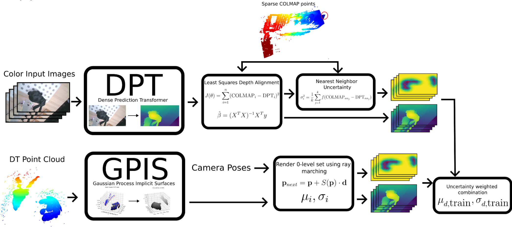
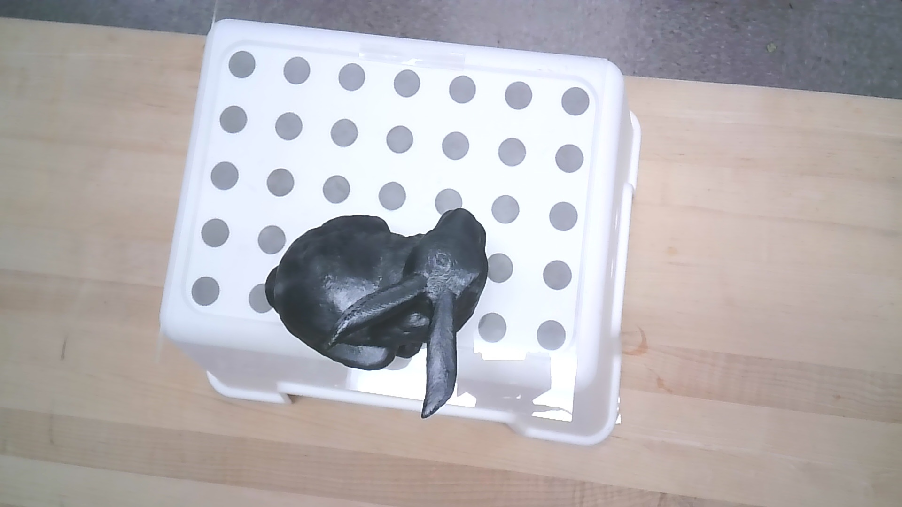
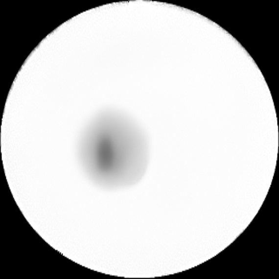
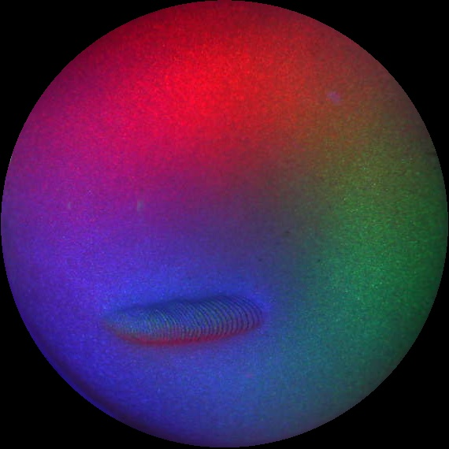
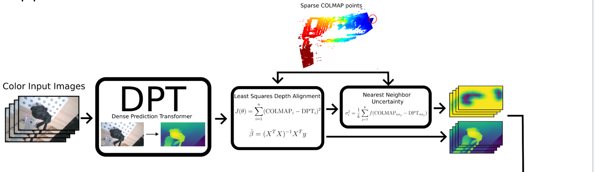
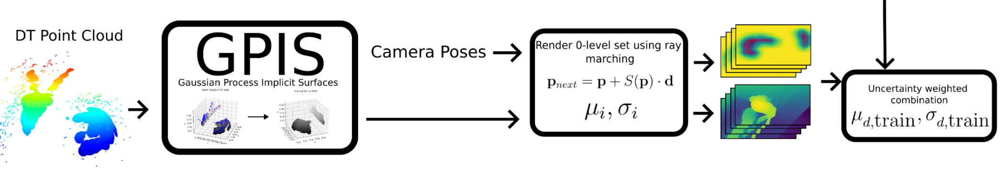

# Visual Tactile Neural Field
Visual Tactile Neural Field (VTNF)

<!-- insert image here -->


Aiden Swann, Matt Strong, Won-Kyung Do

This repo houses code and data for our work in Visual Tactile Neural fields.


## Setup

Install Blender

## Flow

The flow can be broadly broken up into the following sections:

1. Data Collection

    This contains code to create the data from simulation in Blender and real life.
    We use a 7 DoF Franka Panda for our experiments.

2. Data

    This contains the data in Blender in simulation and on the real robot. The format is as follows:


    ```
    data
    |---real
    |   |---touchnerf_<date-1>
            |---touchnerf_rgb_depth_<date-1>
                |---color
                |---depth
                |---recorded_path
                |---touch
                |---touch_raw
            |---touchnerf_touch_1_<date-1>
            |---touchnerf_touch_2<date-1>
    |   |---touchnerf_<date-2>
    |   |---...
    |---sim
        |---blender
            |---dataset
    ```

    We expect a unified format for the raw data, but only require two sources of data: Images, $I_{cam}$, and DenseTact depth images, $D_{DT}$ which form dataset $\mathcal{D}$.


    ### Blender data

    Within the Blender folder, we have a `dataset` folder which contains the train views, test views, corresponding `transforms_<type>.json` file, and depth images (if depth supervision is desired). Note that the depth ground truth images (in `.EXR` format) are the ground truth and can serve as a sanity check when implementing NeRF loss functions that use depth supervision.

    Steps to Run Blender
    
    ========TBD============
    
    


    Within each `touchnerf_<rgb_depth|touch>..` folder are the following folders and contents:

    `color/` folder: contains a `transforms_train.json` which contains the transform (from world frame to camera frame) of each camera and the image path. It also contains a `train/` folder with all of the images in it. 

    Sample image:

    


    `depth/` folder: contains the Intel Realsense depth images from experiments. We do not use these in our experiments however. This folder contains a `transforms_train.json` as well as a `train/` folder with a `.npy` and `.png` file that contains the Intel Realsense depth image. It it not recommended however.

    `recorded_path/` folder: not used. But you can check it out.

    `touch/` folder: contains the predicted depths from DenseTact. Only the `touchnerf_touch_..` folders will have actual touches in them. Each predicted depth in the `train/` folder has an `npy` file and `png` file associated with it.

     


    `touch_raw/` folder: contains the raw depths from DenseTact. Only the `touchnerf_touch_..` folders will have actual touches in them. Each raw depth in the `train/` folder has a `png` file associated with it.

    Sample image:

    


3. Data Preprocessing

    Contains the code for processing RGB images and touches with the DenseTact. We have two separate pipelines for touch and RGB.

    ## RGB camera images

    

    The goal of the RGB camera flow is to 

    Steps:

    1. With the camera images, we first run a tool called [Colmap](https://colmap.github.io/) to compute the camera poses (with an arbitrary frame and scale compared to the real world ).

    We run Colmap on real world data and don't need to run it on Blender data (because the camera poses are ground truth and we have access to ground truth depth maps), but still support it. 

    2. 

    3. 


    
    ## Touch
    

    At a high level, the touch pipeline first requires a set of DenseTact touches (each has an associated point cloud) and the corresponding transforms from world frame to DT frame.

    We can then construct a raw point cloud here by simply combining them. The next step is to use a Gaussian Process Implicit Surface (GPIS) to create a 3d representation of a surface with the object(s). The GPIS gives us where the surface would be as well as variance. To create the resulting depth and uncertainty images. We can perform ray marching on the RGB camera poses to compute for a given camera, what would the depth and uncertainty view based on touches on an object?

    ## Fusion of Vision and Touch
    


    
    DenseTact touch images


4. NeRF training


5. NeRF evaluation

6. NeRF rendering and exporting


## Misc

1. The `legacy` folder contains prior code with a different approach that we had.

2. The `utils` folder contains 

## Environment Setup

We use conda to run our experiments.


## Running the Pipeline

Running the pipeline end to end consists of the following steps:

1. Collect Data


## Datasets 

The datasets consist of two components - one for collecting RGB and depth images, and another for gathering touch image information.

The folder named 'touchnerf_rgbdepth' houses the captured color images and depth images. The corresponding transformation for each image is found in the 'transforms_train.json' file. For additional camera parameters, please refer to the 'multicamera.py' file in the 'simulated_data' branch.

Here is the link to the dataset:

https://drive.google.com/drive/folders/1T0hKlzefZOtlZaseSx5uLss1g5FmX8bv?usp=sharing

